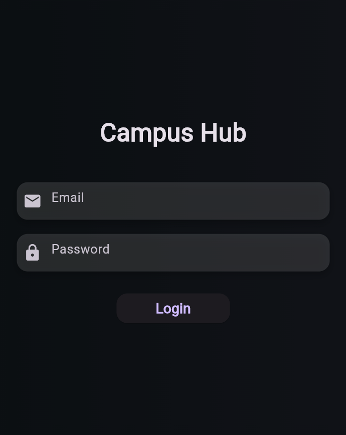
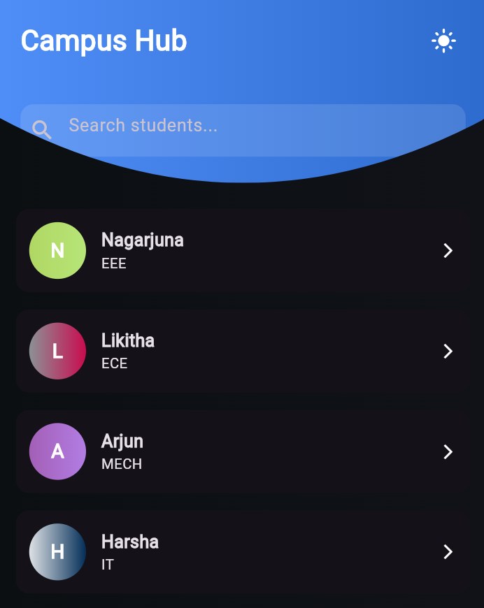
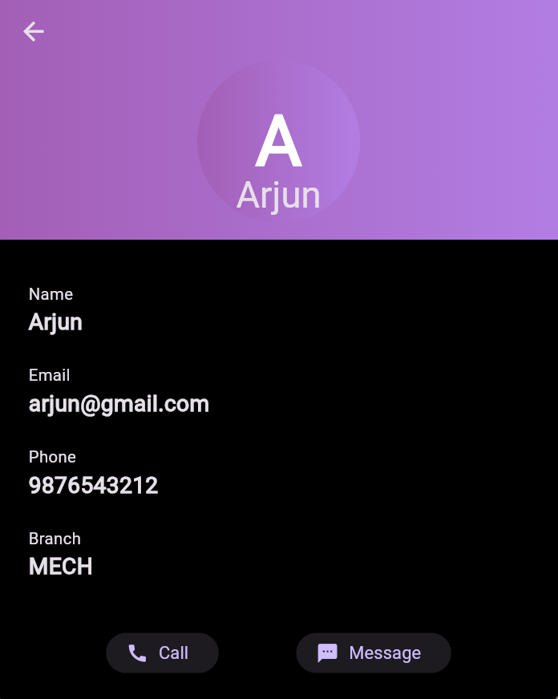

# 📱 Campus Hub App

A simple and clean **Flutter student companion app** designed for learning, UI practice, and resume projects.  
This app includes a dummy login system, dashboard, profile page, notes, tasks, and timetable screens.

---

## 🚀 Features

- 🔐 **Dummy Login System**
- 🏠 **Home Dashboard**
- 👤 **Profile Page**
- 📝 **Notes Screen**
- 🎯 **Tasks / To-Do Screen**
- 📅 **Timetable Screen**
- 🎨 Clean Material UI with custom colors
- 🌐 Runs on **Android, iOS, and Web**

---

## 🔑 Dummy Login Credentials

Use these credentials for demo login:

| Field     | Value                     |
|-----------|---------------------------|
| **Email** | `campusbuddy@demo.com`    |
| **Password** | `Campus@123`          |

---

## 📸 App Screenshots

Store screenshots in the `screenshots/` folder of this repository.

### 🔹 Login Screen  

### 🔹 Home Screen  

### 🔹 Profile Screen  

